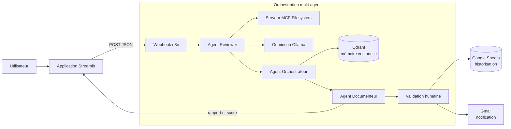

# 🛡️ SMA Clean Code Mentor
### Système d'audit de code multi-agent, hybride et assisté par IA


## 📌 Présentation
**SMA Clean Code Mentor** est une plateforme d'intelligence artificielle agentique dédiée à l'audit automatisé de code source. Elle combine une interface Streamlit, un workflow n8n et plusieurs agents spécialisés afin de produire une revue technique structurée, orientée sécurité et qualité logicielle.

Le projet a été conçu comme une démonstration de système multi-agent pour l'ingénierie des données et l'intelligence artificielle. Chaque responsabilité est séparée pour améliorer la lisibilité et la qualité de l'analyse :
1. **Reviewer** : examine le code et identifie les problèmes techniques et de sécurité.
2. **Orchestrateur** : coordonne l'analyse, consulte la mémoire vectorielle et hiérarchise les résultats.
3. **Documenteur** : transforme les constats en rapport Markdown exploitable.
4. **Validation humaine** : permet de contrôler le rapport avant son archivage.

## 🏗️ Architecture



### Flux de traitement

1. L'utilisateur charge un fichier `.py`, `.js`, `.sql` ou `.pdf` depuis Streamlit.
2. L'application extrait le texte et envoie un payload JSON au webhook n8n.
3. Le workflow coordonne les agents et peut accéder aux fichiers via MCP.
4. Le modèle IA recherche les failles, les problèmes de conception et les écarts de qualité.
5. Qdrant fournit le contexte issu des standards Clean Code utilisés par le workflow.
6. Un rapport et un score sont renvoyés à l'interface.
7. Selon la configuration n8n, le rapport peut être validé humainement puis archivé dans Google Sheets et signalé par Gmail.

## ✨ Fonctionnalités

- **Audit multi-format** : Python, JavaScript, SQL et PDF.
- **Analyse hybride** : Gemini pour l'analyse cloud et Ollama pour une exécution locale ou un mécanisme de repli.
- **Architecture multi-agent** : séparation des rôles Reviewer, Orchestrateur et Documenteur.
- **RAG avec Qdrant** : enrichissement de l'analyse par une base de connaissances vectorielle.
- **Accès contrôlé aux fichiers** : exposition du répertoire d'analyse via le protocole MCP.
- **Human-in-the-loop** : validation du rapport avant son archivage dans le workflow n8n.
- **Reporting** : rapport Markdown, score sur 10, statut et historique Google Sheets.
- **Interface simple** : chargement de fichier, lancement de l'analyse et affichage du résultat.

## 🛠️ Stack technique

| Domaine | Technologies |
| :--- | :--- |
| Interface | Streamlit, Requests |
| Agents et orchestration | n8n, LangGraph, LangChain |
| Modèles IA | Google Gemini, Ollama |
| Protocole d'accès | Model Context Protocol (MCP) |
| Mémoire vectorielle | Qdrant |
| Intégrations | Google Sheets, Gmail, Google APIs |
| Infrastructure locale | Docker Compose |
| Formats analysés | `.py`, `.js`, `.sql`, `.pdf` |

## 📂 Structure du projet

```text
.
├── code sma/
│   └── app.py                    # Interface Streamlit et appel du webhook n8n
├── code_to_review/               # Répertoire monté dans le conteneur n8n
├── mcp_review/
│   ├── cloud_backup_script.py    # Exemple Python avec problèmes de sécurité
│   ├── oui.js                    # Exemple JavaScript à auditer
│   ├── test.sql                  # Exemple SQL à auditer
│   └── web.py                    # Exemple Express avec failles volontairement introduites
├── docker-compose.yml            # Services Qdrant et n8n
├── pyproject.toml                # Métadonnées et dépendances Python
├── comment éxecuter le prjt.txt  # Notes d'exécution originales
├── readme.md                     # Documentation du projet
└── video.mp4                     # Démonstration du projet

Le workflow n8n et les identifiants des services externes sont configurés dans n8n et ne sont pas stockés dans ce dépôt.

## 🚀 Installation locale

### Prérequis

- Windows 10/11 ou environnement compatible Docker.
- Python 3.9 ou supérieur.
- Docker Desktop avec Docker Compose.
- Node.js et `npx` pour lancer Supergateway.
- Ollama installé si le modèle local est utilisé.
- Accès Google AI Studio/Gemini si l'analyse cloud est activée.

### 1. Installer les dépendances Python

Depuis la racine du projet :

```powershell
python -m venv .venv
.\.venv\Scripts\Activate.ps1
python -m pip install --upgrade pip
pip install -e .
```

Si l'activation PowerShell est bloquée, utilisez un terminal Command Prompt :

```bat
```
.venv\Scripts\activate
```

### 2. Démarrer Qdrant et n8n

```powershell
docker compose up -d
```

Services disponibles :

- **n8n** : <http://localhost:5678>
- **Qdrant Dashboard** : <http://localhost:6333/dashboard>
Les données sont conservées dans les volumes Docker `n8n_data` et `qdrant_data`.

### 3. Démarrer Ollama (facultatif)

Vérifiez qu'Ollama est accessible et que le modèle requis est installé :

```powershell
ollama list
```

Le nom exact du modèle et sa configuration dépendent du workflow n8n importé.

### 4. Démarrer le serveur MCP filesystem

Dans un nouveau terminal, adaptez le chemin du répertoire exposé puis laissez le processus actif :

```powershell
npx -y supergateway `
	--stdio "npx @modelcontextprotocol/server-filesystem C:\chemin\vers\mcp_review" `
	--port 8765 `
	--baseUrl http://localhost:8765 `
	--cors `
	--outputTransport streamableHttp
```

Le serveur MCP doit être déclaré dans le workflow n8n avec l'URL et le transport correspondants.

### 5. Configurer n8n

Dans l'éditeur n8n :

1. Importez ou créez le workflow multi-agent du projet.
2. Configurez les credentials Gemini ou Ollama.
3. Configurez Qdrant et chargez les documents de référence Clean Code.
4. Configurez les credentials Gmail et Google Sheets si l'archivage est activé.
5. Activez le webhook utilisé par l'application Streamlit.

L'application utilise actuellement l'URL du webhook définie dans `code sma/app.py`. Pour une autre instance n8n, modifiez cette configuration ou externalisez-la dans `st.secrets` avant un déploiement public.

## ▶️ Utilisation

Depuis la racine du projet :

```powershell
streamlit run "code sma/app.py"
```

L'interface est ensuite accessible à l'adresse <http://localhost:8501>.

1. Sélectionnez un fichier à analyser.
2. Cliquez sur **Lancer l'Analyse IA**.
3. Consultez le rapport et le score retournés par n8n.

Des fichiers de démonstration sont disponibles dans `mcp_review/` afin de tester l'audit sur plusieurs langages.

Pour arrêter les services :

```powershell
docker compose down
```

Pour supprimer également les données persistées :

```powershell
docker compose down -v
```

## 🔐 Sécurité

Les fichiers de `mcp_review/` contiennent volontairement des exemples de mauvaises pratiques : secrets en clair, privilèges SQL excessifs, mot de passe root, désactivation de la vérification TLS, secret JWT exposé et injection de commande. Ils servent uniquement à démontrer les capacités de détection.

Les fichiers texte de configuration présents dans le projet contiennent également des valeurs de démonstration liées à Google. **Ne réutilisez jamais ces valeurs dans un environnement réel** : révoquez-les et créez de nouveaux credentials avant tout partage ou déploiement.

Bonnes pratiques recommandées :

- stocker les clés dans les credentials n8n, un gestionnaire de secrets ou des variables d'environnement ;
- ne jamais committer de secrets, tokens ou mots de passe ;
- limiter le répertoire exposé au serveur MCP ;
- remplacer `http://localhost` par HTTPS et sécuriser les cookies pour un déploiement distant ;
- utiliser un webhook authentifié et ne pas publier son URL dans une application publique.

## ⚠️ Limites connues

- Le workflow n8n n'est pas versionné dans la structure actuellement fournie ; son export doit être géré séparément.
- Le webhook est actuellement configuré directement dans le code Streamlit.
- Le fonctionnement complet dépend des credentials Google, du serveur MCP, de Qdrant et du workflow n8n.
- Les exemples audités sont volontairement vulnérables et ne doivent pas être exécutés en production.
- Aucun jeu de tests automatisés n'est fourni dans la structure actuelle du projet.

## 👥 Auteurs

- **El Boudounti Marwan**

Projet académique autour de l'IA distribuée, des systèmes multi-agent et de l'audit automatisé de code.

## 📄 Licence

Ce projet est distribué sous licence **MIT**, conformément aux métadonnées de `pyproject.toml`.
 SMA Clean Code Mentor — Système d'Audit Multi-Agent Hybride
 Présentation :
Le SMA Clean Code Mentor est un écosystème d'intelligence artificielle agentique conçu pour automatiser l'audit de code source. En s'appuyant sur une architecture Multi-Agent (LLM) orchestrée par n8n, ce système surmonte les limites des prompts uniques en séparant les responsabilités pour garantir une revue technique précise, sévère et structurée.

🏗️ Architecture du Système
L'architecture repose sur un graphe d'agents spécialisés, tel qu'illustré dans le workflow n8n :

AI Agent Reviewer : Analyse le code via le MCP (Model Context Protocol) pour extraire les failles techniques (Injections SQL, secrets en clair). Il utilise Gemini pour une analyse haute performance.

Agent Orchestrateur : Agit comme Tech Lead. Il consulte la mémoire vectorielle Qdrant pour valider les standards de code et prioriser les problèmes détectés.

Agent Documenteur : Synthétise l'analyse technique en un rapport Markdown formel, prêt pour la validation.

🚀 Fonctionnalités Clés
Audit Hybride (Cloud/Local) : Utilisation de Gemini pour la précision.

Human-In-The-Loop (HITL) : Intégration d'un nœud de pause (Wait) dans n8n pour exiger une validation humaine via Gmail avant tout archivage.

Accès Système Intelligent : Utilisation du protocole MCP pour permettre aux agents de lire dynamiquement les fichiers sources dans l'environnement de travail.

Résilience (Fallback) : Bascule automatique vers le modèle local Llama 3.2 si l'API Cloud est indisponible ou hors quota.

🛠️ Stack Technique & Infrastructure
Moteurs d'IA (LLM) :

Google Gemini : Moteur principal pour le "Chat Model" et l'analyse critique.

Orchestrateur Low-Code : n8n centralise la logique métier et connecte les agents aux services externes via un workflow visuel.

Mémoire Vectorielle (RAG) : Qdrant stocke les standards de "Clean Code" pour enrichir le contexte des agents lors de l'audit.

Stockage & Reporting :

Google Sheets : Historisation et archivage automatique des scores et des logs d'audit.

Gmail API : Canal de communication pour les alertes critiques et les liens de validation humaine.
